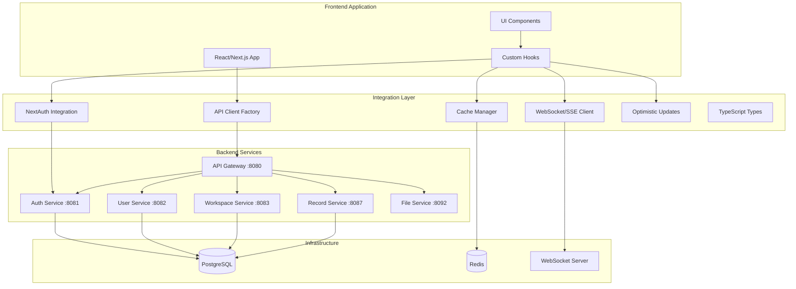

# PyAirtable Frontend Integration Layer

A comprehensive, type-safe integration layer for connecting modern frontend applications with the PyAirtable Go microservices backend.

## Architecture Overview



## Features

### ✅ Type-Safe API Clients
- Complete TypeScript definitions for all backend services
- Auto-generated from Go service definitions
- Service-specific clients with error handling
- Request/response validation

### ✅ Authentication Integration
- NextAuth.js provider for Go backend authentication
- JWT token management with automatic refresh
- Role-based access control
- Session management

### ✅ Advanced Caching
- Multi-level caching with TTL and tags
- Intelligent cache invalidation
- Stale-while-revalidate strategy
- Query caching with dependency tracking
- Persistence to localStorage

### ✅ Real-time Events
- WebSocket and Server-Sent Events support
- Automatic fallback mechanism
- Event subscription management
- Connection health monitoring
- Automatic reconnection

### ✅ Optimistic Updates
- Immediate UI updates with rollback
- Conflict resolution
- Cache integration
- Retry mechanisms
- Error handling

### ✅ Offline Support
- Request queuing for offline scenarios
- Automatic sync when online
- PWA compatibility
- Background processing

### ✅ Error Handling
- Comprehensive error types
- Retry logic with exponential backoff
- Circuit breaker pattern
- Error boundary integration

### ✅ Performance Optimization
- Request deduplication
- Response caching
- Connection pooling
- Lazy loading support

## Quick Start

### Installation

```bash
npm install @pyairtable/frontend-integration
```

### Basic Setup

```typescript
import { createPyAirtableIntegration } from '@pyairtable/frontend-integration';

// Initialize the integration layer
const pyairtable = createPyAirtableIntegration({
  baseURL: 'http://localhost:8080/api/v1',
  features: {
    enableRealtime: true,
    enableOptimisticUpdates: true,
    enableOfflineSupport: true,
  },
});

// Initialize with user session
await pyairtable.initialize(session);
```

### React Integration

```typescript
import { PyAirtableProvider, usePyAirtable } from '@pyairtable/frontend-integration';

// App.tsx
function App() {
  return (
    <PyAirtableProvider config={{ baseURL: process.env.NEXT_PUBLIC_API_URL }}>
      <Dashboard />
    </PyAirtableProvider>
  );
}

// Dashboard.tsx
function Dashboard() {
  const pyairtable = usePyAirtable();
  const [workspaces, setWorkspaces] = useState([]);

  useEffect(() => {
    async function loadWorkspaces() {
      const data = await pyairtable.services.workspace.getWorkspaces();
      setWorkspaces(data.data);
    }
    loadWorkspaces();
  }, []);

  return (
    <div>
      {workspaces.map(workspace => (
        <WorkspaceCard key={workspace.id} workspace={workspace} />
      ))}
    </div>
  );
}
```

### NextAuth.js Setup

```typescript
// pages/api/auth/[...nextauth].ts
import { authOptions } from '@pyairtable/frontend-integration';

export default NextAuth(authOptions);
```

```typescript
// _app.tsx
import { SessionProvider } from 'next-auth/react';

export default function App({
  Component,
  pageProps: { session, ...pageProps },
}) {
  return (
    <SessionProvider session={session}>
      <PyAirtableProvider session={session}>
        <Component {...pageProps} />
      </PyAirtableProvider>
    </SessionProvider>
  );
}
```

## API Reference

### Service Clients

#### Record Service

```typescript
const recordService = pyairtable.services.record;

// Get records with caching
const records = await recordService.getRecords({
  table_id: 'tbl123',
  view_id: 'viw456',
  fields: ['Name', 'Status'],
  sort: [{ field: 'Created', direction: 'desc' }],
});

// Create record with optimistic update
const { updateId, optimisticRecord } = await pyairtable.optimistic.optimisticCreateRecord(
  'tbl123',
  { Name: 'New Record', Status: 'Active' }
);

try {
  const actualRecord = await recordService.createRecord({
    table_id: 'tbl123',
    fields: { Name: 'New Record', Status: 'Active' },
  });
  pyairtable.optimistic.confirmUpdate(updateId, actualRecord);
} catch (error) {
  pyairtable.optimistic.rollbackUpdate(updateId, error);
}
```

#### Workspace Service

```typescript
const workspaceService = pyairtable.services.workspace;

// Get workspaces
const workspaces = await workspaceService.getWorkspaces();

// Create workspace
const workspace = await workspaceService.createWorkspace({
  name: 'My Workspace',
  description: 'A new workspace for my team',
});

// Add member
await workspaceService.addWorkspaceMember(workspace.id, {
  user_id: 'usr123',
  role: 'editor',
});
```

### Real-time Events

```typescript
// Subscribe to record changes
const subscriptionId = pyairtable.realtime.subscribeToRecordChanges(
  'tbl123',
  (event) => {
    switch (event.type) {
      case 'record.created':
        console.log('New record:', event.payload.record);
        break;
      case 'record.updated':
        console.log('Updated record:', event.payload.record);
        console.log('Changes:', event.payload.changes);
        break;
      case 'record.deleted':
        console.log('Deleted record:', event.payload.record_id);
        break;
    }
  }
);

// Unsubscribe
pyairtable.realtime.unsubscribe(subscriptionId);
```

### Caching

```typescript
// Manual cache management
await pyairtable.invalidateCache(`records:${tableId}:`);
await pyairtable.clearCache();

// Cache strategies
const cacheKey = pyairtable.cache.strategies.recordList({
  table_id: 'tbl123',
  view_id: 'viw456',
});

// Invalidate by tag
pyairtable.cache.invalidation.onRecordUpdated('tbl123', 'rec123', changes);
```

### Error Handling

```typescript
import { ServiceError, ErrorHandler } from '@pyairtable/frontend-integration';

try {
  const record = await recordService.getRecord('rec123');
} catch (error) {
  if (error instanceof ServiceError) {
    if (error.code === 404) {
      console.log('Record not found');
    } else if (error.type === 'AUTH_ERROR') {
      // Redirect to login
    } else if (error.type === 'NETWORK_ERROR') {
      // Show network error message
    }
    
    const userMessage = ErrorHandler.getErrorMessage(error);
    showNotification(userMessage);
  }
}
```

## React Hooks

### useRealtime

```typescript
import { useRealtime } from '@pyairtable/frontend-integration';

function RecordList({ tableId }: { tableId: string }) {
  const { connected, subscribed } = useRealtime(
    { channel: 'record', filters: { table_id: tableId } },
    (event) => {
      // Handle real-time events
      if (event.type === 'record.created') {
        setRecords(prev => [...prev, event.payload.record]);
      }
    }
  );

  return (
    <div>
      {!connected && <div>Connecting to real-time updates...</div>}
      {/* Record list */}
    </div>
  );
}
```

### useOptimisticUpdate

```typescript
import { useOptimisticUpdate } from '@pyairtable/frontend-integration';

function RecordForm({ tableId }: { tableId: string }) {
  const { mutate, isOptimistic, rollback } = useOptimisticUpdate(
    async (data) => {
      return pyairtable.services.record.createRecord({
        table_id: tableId,
        fields: data,
      });
    },
    { maxRetries: 3 }
  );

  const handleSubmit = async (formData) => {
    try {
      await mutate(formData);
    } catch (error) {
      if (isOptimistic) {
        rollback();
      }
      showError(error.message);
    }
  };

  return (
    <form onSubmit={handleSubmit}>
      {isOptimistic && <div>Saving...</div>}
      {/* Form fields */}
    </form>
  );
}
```

## Configuration

### API Client Configuration

```typescript
const config = {
  baseURL: 'http://localhost:8080/api/v1',
  timeout: 30000,
  retryAttempts: 3,
  retryDelay: 1000,
  enableCaching: true,
  cacheTimeout: 5 * 60 * 1000, // 5 minutes
  enableOptimisticUpdates: true,
  enableOfflineQueue: true,
  
  // Cache configuration
  cacheConfig: {
    defaultTTL: 5 * 60 * 1000,
    maxSize: 1000,
    enablePersistence: true,
  },
  
  // Real-time configuration
  realtimeConfig: {
    websocketUrl: 'ws://localhost:8080/ws',
    sseUrl: 'http://localhost:8080/events',
    enableSSEFallback: true,
  },
  
  // Feature flags
  features: {
    enableRealtime: true,
    enableOptimisticUpdates: true,
    enableOfflineSupport: true,
  },
};
```

### Environment Variables

```bash
# API Configuration
NEXT_PUBLIC_API_URL=http://localhost:8080/api/v1
NEXT_PUBLIC_WS_URL=ws://localhost:8080/ws

# Authentication
NEXTAUTH_URL=http://localhost:3000
NEXTAUTH_SECRET=your-secret-key

# Features
NEXT_PUBLIC_ENABLE_REALTIME=true
NEXT_PUBLIC_ENABLE_OPTIMISTIC=true
NEXT_PUBLIC_ENABLE_OFFLINE=true
```

## Service Architecture

### Backend Services

| Service | Port | Description |
|---------|------|-------------|
| API Gateway | 8080 | Main entry point, routing, auth |
| Auth Service | 8081 | Authentication, JWT tokens |
| User Service | 8082 | User profiles, preferences |
| Workspace Service | 8083 | Workspace management, members |
| Base Service | 8084 | Base (database) management |
| Table Service | 8085 | Table schema, metadata |
| View Service | 8086 | Views, filters, sorting |
| Record Service | 8087 | Record CRUD operations |
| Field Service | 8088 | Field definitions, types |
| File Service | 8092 | File uploads, attachments |
| Webhook Service | 8096 | Webhook management |

### Data Flow

1. **Request Flow**: Frontend → API Gateway → Microservice → Database
2. **Response Flow**: Database → Microservice → API Gateway → Frontend
3. **Real-time Flow**: Database → Event Bus → WebSocket/SSE → Frontend
4. **Cache Flow**: Frontend Cache ← API Response ← Backend

## Performance Considerations

### Caching Strategy

- **User Profile**: 15 minutes TTL, stale-while-revalidate
- **Workspace List**: 5 minutes TTL, stale-while-revalidate
- **Record Lists**: 2 minutes TTL, invalidate on changes
- **Table Schema**: 30 minutes TTL, invalidate on schema changes

### Request Optimization

- Request deduplication for identical concurrent requests
- Automatic retry with exponential backoff
- Circuit breaker for failing services
- Connection pooling and keep-alive

### Real-time Optimization

- Event batching to reduce update frequency
- Subscription management to avoid memory leaks
- Automatic reconnection with backoff
- Fallback to polling if WebSocket fails

## Security

### Authentication

- JWT tokens with automatic refresh
- Secure token storage in httpOnly cookies
- CSRF protection
- Role-based access control

### Data Protection

- Request/response validation
- XSS protection headers
- CORS configuration
- Rate limiting

### Privacy

- Data encryption in transit
- Secure WebSocket connections (WSS)
- Token expiration and rotation
- Audit logging

## Monitoring and Debugging

### Health Checks

```typescript
// Check service health
const health = pyairtable.getServiceHealth();
console.log('Services healthy:', health);

// Connection status
const status = pyairtable.getConnectionStatus();
console.log('Connection status:', status);
```

### Debug Mode

```typescript
// Enable debug logging
const pyairtable = createPyAirtableIntegration({
  debug: process.env.NODE_ENV === 'development',
});
```

### Performance Metrics

- Request latency tracking
- Cache hit/miss ratios
- WebSocket connection stability
- Optimistic update success rates

## Troubleshooting

### Common Issues

1. **Authentication Errors**
   - Check JWT token expiration
   - Verify backend auth service is running
   - Ensure correct CORS configuration

2. **Connection Issues**
   - Verify backend services are accessible
   - Check network connectivity
   - Review firewall settings

3. **Cache Issues**
   - Clear cache manually if stale data persists
   - Check cache invalidation logic
   - Verify TTL settings

4. **Real-time Issues**
   - Check WebSocket connection status
   - Verify SSE fallback configuration
   - Ensure proper subscription management

### Debug Commands

```typescript
// Clear all caches
await pyairtable.clearCache();

// Force reconnect to WebSocket
await pyairtable.realtime.manager.disconnect();
await pyairtable.realtime.manager.connect(accessToken);

// Check pending optimistic updates
const pending = pyairtable.optimistic.getPendingUpdates();
console.log('Pending updates:', pending);

// Get cache statistics
const stats = pyairtable.cache.manager.getStats();
console.log('Cache stats:', stats);
```

## Contributing

1. Fork the repository
2. Create a feature branch
3. Make your changes
4. Add tests
5. Submit a pull request

## License

MIT License - see LICENSE file for details.

## Support

For support and questions:
- GitHub Issues: [Create an issue](https://github.com/pyairtable/frontend-integration/issues)
- Documentation: [Full documentation](https://docs.pyairtable.com/integration)
- Discord: [Join our community](https://discord.gg/pyairtable)